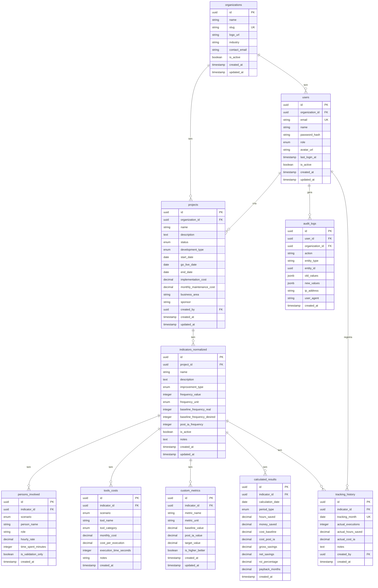

# Documentação do Schema do Banco de Dados

## Visão Geral

Este documento descreve a estrutura completa do banco de dados normalizado da Plataforma de ROI para Projetos de IA.

## Diagrama ERD



## Tabelas Principais

### organizations
Armazena organizações/clientes (multi-tenancy).

**Campos Principais:**
- `id`: UUID (PK)
- `name`: Nome da organização
- `slug`: Identificador URL-friendly (único)
- `is_active`: Status de ativação

### users
Armazena usuários do sistema com roles.

**Campos Principais:**
- `id`: UUID (PK, mesmo do auth.users)
- `organization_id`: FK para organizations
- `email`: Email único
- `role`: ENUM (admin, manager, analyst, viewer)

### projects
Armazena projetos de IA.

**Campos Principais:**
- `id`: UUID (PK)
- `organization_id`: FK para organizations
- `status`: ENUM (planning, development, testing, production, etc.)
- `development_type`: ENUM (chatbot, copilot, automation_n8n, etc.)
- `implementation_cost`: Custo único de implementação
- `monthly_maintenance_cost`: Custo mensal de manutenção

### indicators_normalized
Armazena indicadores/tarefas normalizados.

**Campos Principais:**
- `id`: UUID (PK)
- `project_id`: FK para projects
- `improvement_type`: ENUM (productivity, analytical_capacity, etc.)
- `frequency_value` + `frequency_unit`: Frequência de execução
- `baseline_frequency_real`: Frequência real antes da IA
- `post_ia_frequency`: Frequência após IA

### persons_involved
Armazena pessoas envolvidas em cada cenário.

**Campos Principais:**
- `indicator_id`: FK para indicators_normalized
- `scenario`: ENUM (baseline ou post_ia)
- `hourly_rate`: Valor da hora (R$)
- `time_spent_minutes`: Tempo por execução (minutos)

### tools_costs
Armazena custos de ferramentas e APIs.

**Campos Principais:**
- `indicator_id`: FK para indicators_normalized
- `scenario`: ENUM (baseline ou post_ia)
- `tool_category`: ENUM (llm_api, automation, etc.)
- `monthly_cost`: Custo mensal (R$)
- `cost_per_execution`: Custo por execução (opcional)

### calculated_results
Tabela materializada com resultados calculados.

**Campos Principais:**
- `indicator_id`: FK para indicators_normalized
- `calculation_date`: Data do cálculo
- `hours_saved`: Horas economizadas
- `money_saved`: Valor economizado (R$)
- `roi_percentage`: ROI em percentual
- `payback_months`: Payback em meses

### tracking_history
Histórico de acompanhamento mensal.

**Campos Principais:**
- `indicator_id`: FK para indicators_normalized
- `tracking_month`: Mês de referência (único por indicador)
- `actual_executions`: Execuções reais no mês
- `actual_hours_saved`: Horas economizadas reais
- `actual_cost_ia`: Custo real da IA no mês

## ENUMs

### user_role
- `admin`: Administrador completo
- `manager`: Gerente de projetos
- `analyst`: Analista
- `viewer`: Apenas visualização

### project_status
- `planning`: Em planejamento
- `development`: Em desenvolvimento
- `testing`: Em testes
- `production`: Em produção
- `on_hold`: Pausado
- `completed`: Concluído
- `cancelled`: Cancelado

### development_type
- `chatbot`: Chatbot/Assistente Virtual
- `copilot`: Copiloto de IA
- `automation_n8n`: Automação via N8N
- `automation_rpa`: RPA Tradicional
- `integration`: Integração de sistemas
- `dashboard`: Dashboard analítico
- `ml_model`: Modelo de Machine Learning
- `nlp_analysis`: Análise de Linguagem Natural
- `document_processing`: Processamento de documentos
- `other`: Outros

### improvement_type
- `productivity`: Produtividade
- `analytical_capacity`: Capacidade Analítica
- `revenue_increase`: Incremento de Receita
- `cost_reduction`: Redução de Custo
- `risk_reduction`: Redução de Risco
- `decision_quality`: Qualidade da Decisão
- `speed`: Velocidade
- `satisfaction`: Satisfação

### frequency_unit
- `hour`: Por hora
- `day`: Por dia
- `week`: Por semana
- `month`: Por mês
- `quarter`: Por trimestre
- `year`: Por ano

### scenario_type
- `baseline`: Cenário antes da IA
- `post_ia`: Cenário após implementação da IA

### tool_category
- `llm_api`: APIs de LLM
- `automation`: Ferramentas de automação
- `analytics`: BI e Analytics
- `database`: Banco de dados
- `cloud_infra`: Infraestrutura cloud
- `saas`: SaaS diversos
- `custom`: Desenvolvimento customizado
- `other`: Outros

## Índices

Todos os índices foram criados para otimizar queries frequentes:

- `idx_organizations_slug`: Busca por slug
- `idx_users_email`: Busca por email
- `idx_users_organization_id`: Filtro por organização
- `idx_projects_organization_id`: Filtro de projetos por organização
- `idx_projects_status`: Filtro por status
- `idx_indicators_project_id`: Indicadores por projeto
- `idx_persons_indicator_id`: Pessoas por indicador
- `idx_tools_indicator_id`: Ferramentas por indicador
- `idx_calculated_indicator_id`: Resultados por indicador
- `idx_tracking_indicator_month`: Tracking único por mês/indicador

## Row Level Security (RLS)

Todas as tabelas têm RLS habilitado com políticas que:

1. **Filtram por organization_id**: Usuários só veem dados da sua organização
2. **Respeitam roles**: Permissões baseadas em admin, manager, analyst, viewer
3. **Protegem dados sensíveis**: Apenas usuários autorizados podem modificar

## Exemplos de Queries

### Buscar projetos da organização
```sql
SELECT * FROM projects 
WHERE organization_id = 'uuid-da-organizacao'
ORDER BY created_at DESC;
```

### Buscar indicador completo com relacionamentos
```sql
SELECT 
  i.*,
  json_agg(DISTINCT jsonb_build_object(
    'id', p.id,
    'person_name', p.person_name,
    'role', p.role,
    'hourly_rate', p.hourly_rate,
    'time_spent_minutes', p.time_spent_minutes
  )) FILTER (WHERE p.scenario = 'baseline') as persons_baseline,
  json_agg(DISTINCT jsonb_build_object(
    'id', t.id,
    'tool_name', t.tool_name,
    'monthly_cost', t.monthly_cost
  )) FILTER (WHERE t.scenario = 'post_ia') as tools_post_ia
FROM indicators_normalized i
LEFT JOIN persons_involved p ON p.indicator_id = i.id
LEFT JOIN tools_costs t ON t.indicator_id = i.id
WHERE i.id = 'uuid-do-indicador'
GROUP BY i.id;
```

### Calcular ROI consolidado da organização
```sql
SELECT 
  COUNT(DISTINCT p.id) as total_projetos,
  SUM(cr.money_saved * 12) as economia_anual_total,
  AVG(cr.roi_percentage) as roi_medio
FROM projects p
JOIN indicators_normalized i ON i.project_id = p.id
JOIN calculated_results cr ON cr.indicator_id = i.id
WHERE p.organization_id = 'uuid-da-organizacao'
  AND cr.period_type = 'monthly';
```

## Referências

- Especificação Técnica Completa (documento principal)
- `migrations/001_create_normalized_schema.sql` - Schema completo
- `migrations/003_setup_rls.sql` - Políticas de segurança
